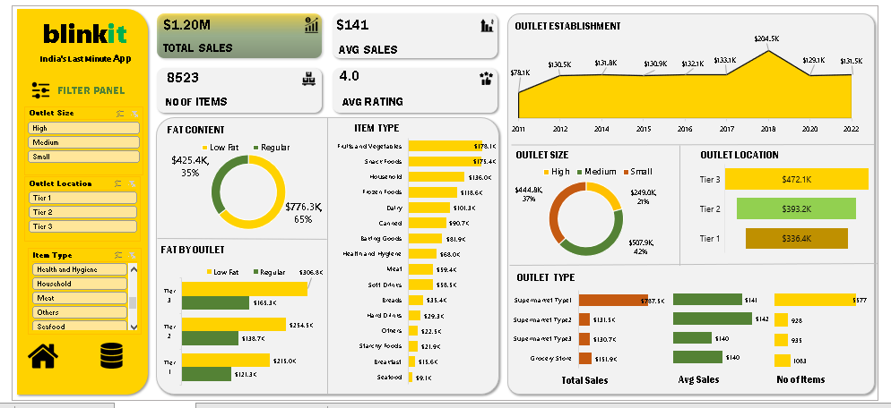

# Blinkit Sales Analysis Dashboard

An interactive Microsoft Excel dashboard developed to analyze Blinkit's sales performance, customer ratings, product categories, and outlet distribution. This project transforms raw sales data into meaningful business insights using Excel's advanced data analysis and visualization features.

---

## 📌 Project Overview

The objective of this project is to analyze Blinkit's sales data and build an interactive dashboard that helps users monitor business performance through key performance indicators (KPIs), charts, and filters. The dashboard enables quick analysis of sales trends, customer behavior, and outlet performance for better decision-making.

---

## 🎯 Objectives

- Analyze overall sales performance.
- Identify top-performing product categories.
- Compare outlet sales across different locations.
- Evaluate customer ratings and product distribution.
- Build an interactive dashboard for business reporting.

---

## 📊 Dashboard Preview

> **Dashboard Screenshot**



---

## 📈 Key Performance Indicators (KPIs)

| KPI | Value |
|------|-------|
| Total Sales | $1.20M |
| Average Sales | $141 |
| Total Items Sold | 8,523 |
| Average Customer Rating | 4.0 |

---

## 🔍 Features

- Interactive Dashboard
- Pivot Tables
- Pivot Charts
- Slicers for Dynamic Filtering
- Conditional Formatting
- KPI Cards
- Category-wise Sales Analysis
- Outlet Performance Analysis
- Customer Rating Analysis

---

## 🛠️ Tools & Technologies

- Microsoft Excel
- Pivot Tables
- Pivot Charts
- Slicers
- Conditional Formatting
- Data Cleaning
- Data Analysis
- Dashboard Design

---

## 📂 Project Workflow

### 1. Data Collection
- Imported Blinkit sales dataset into Microsoft Excel.

### 2. Data Cleaning
- Removed duplicate records.
- Handled missing values.
- Corrected data types.
- Organized data for analysis.

### 3. Data Analysis
- Created Pivot Tables to summarize sales data.
- Performed category-wise and outlet-wise analysis.
- Calculated business KPIs.

### 4. Dashboard Development
- Built interactive charts and KPI cards.
- Added slicers for dynamic filtering.
- Designed a clean and user-friendly dashboard layout.

---

## 💡 Business Insights

- Fruits & Vegetables and Snack Foods generated the highest sales.
- Tier 3 cities contributed the largest share of total revenue.
- Customer ratings remained consistent with an average rating of 4.0.
- Some product categories showed lower sales and inventory levels, indicating potential growth opportunities.

---

## 🚀 Skills Demonstrated

- Data Cleaning
- Data Validation
- Data Analysis
- Business Analysis
- Dashboard Design
- Data Visualization
- KPI Reporting
- Microsoft Excel

---

## 📁 Repository Structure

```
Blinkit-Sales-Analysis-Dashboard/
│
├── Blinkit Dataset For Excel Dashboard.xlsx
├── Blinkit.PNG
└── README.md
```

---

## 👨‍💻 Author

**Suraj Kumar Yadav**

- LinkedIn: https://www.linkedin.com/in/suraj-kryadav7
- GitHub: https://github.com/suraj-cse7

---

⭐ If you found this project useful, feel free to star this repository.
